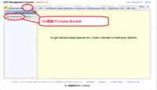
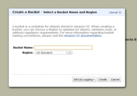
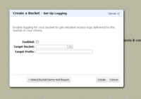

ではS3の管理画面を使ってバックアップの場所を登録しましょう。

S3では「Bucket(バケット)」と呼ばれている保存場所を予め用意して、そこにファイルを保存するようになっています。

しかもこのBucketをOS起動イメージとして使うことが出来ます。
OS起動時に「AMI」という物を指定したのを思い出してください。
現在起動中のOSイメージをこのAMIの形式でBucketにバックアップすることで、OSイメージバックアップを実現するのです。

AMIとBucketは1対1なので、イメージバックアップ１つに対して１つのBucketを作成します。
Bucketには名前をつけなければ成らないのですが、これが困ったことに世界中のS3を使用しているユーザーの中でユニークな唯一のBucket名を付けなければいけないようです(もしかしたらRegion内でユニークかもしれません)。
ですからネーミングルールは相当考えて作ってください。

ではBucketを作りましょう。
Create Bucketのボタンで作成を開始します。

Bucket名と作成するリージョンを指定します。今はOSのイメージバックアップなので必ず起動中のInstanceと同じリージョンを選んでください。
たとえば私の場合は既述のようにアメリカ東海岸を一押ししていますのでInstanceはアメリカ東海岸で起動させています。
その場合ここで指定するのは「US Standard」を指定します。
日本が大好きな方はInstanceは日本で起動しているはずなのでここでは「Tokyo」を指定することになります。

次に「Create」ボタンで作成ですが、「Set Up Logging」というボタンがあります。これはアクセスのログをとるのですが、今回の目的はOSのイメージバックアップなのでログは必要ありません。
そのままログなしで作成しましょう。
作成すると画面左側のBucket一覧に作成したBucketの前が表示されるはずです。

