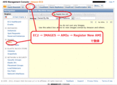
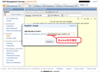

## ec2-ami-tools
次にOSのバックアップイメージを作りたいのですが、いくつか用意するものがあります。
1つ目は、ec2-ami-toolsです。このツールはAMIのイメージを作るためのコマンド群です。
ただし、既存のAMI使ってInstance起動しているのであれば、たいていこれは起動中のInstanceのイメージの中にインストール済みのはずです。
万が一ない場合は以下からダウンロードできますので起動中のInstanceの中でインストールしてください。

> http://s3.amazonaws.com/ec2-downloads/ec2-ami-tools.noarch.rpm

## 証明書アップロード
次にコマンドを使うためのX.509証明書とPrivate Keyです。これは「アクセスキーの取得」の章ですでにダウンロード済みです。
pk-XXXXXXXXXXXXXX.pemとcert-XXXXXXXXXXXXXX.pemの２つのファイルを起動中のInstanceの適当な場所にアップロードしておいてください。

## バックアップ作業領域
次に作業領域を確保します。
一般的なEC2のAMIのディスク構成は起動用パーティションと未使用パーティションに分かれています。
AMIとしてOSイメージバックアップが出来るのは起動用パーティションのみです。残りのパーティションは空の状態で起動され、マウントすることでデータ領域として使うことが出来ます。
たとえば/mntにマウントしていたとすると、/mntの空き領域を利用してバックアップイメージを作成します。

## イメージファイルの作成
作業領域が確保できたら出来る限りのプロセスを終了させておいてください。これは普通のイメージバックアップを取るときと同じです。
そしてrootでログオンした状態からおもむろに

> \# mkdir /mnt/backup
>
> \# ec2-bundle-vol -d /mnt/backup --privatekey pk-XXXXXXXXXXXXXX.pem --cert cert-XXXXXXXXXXXXXX.pem --user 「口座番号」 --fstab /etc/fstab

これで１０分程度すると起動用パーティションのバックアップがAMIイメージとして作成されます。

## S3へアップロード
準備は整いましたので、やっとバックアップイメージを作り始めます。

> \# cd /mnt/backup
>
> \# ec2-upload-bundle --bucket 「Buket名」 --manifest image.manifest.xml --access-key 「アクセスキー ID」 --secret-key 「シークレットアクセスキー」

これも１０分程度するとAMIイメージがS3にアップロードされます。

## AMI登録
ここまで出来たらAWS Console画面に戻ります。
EC2の管理画面からアップロードしてたAMIイメージを、起動できるように登録します。
EC2タブから左側のIMAGESの下のAMIsを開いてください。

URLを指定する画面が出てきますので、「Bucket名/image.manifest.xml」をしてします。
manifest(マニフェスト)AMIの中身の情報を記述してあるファイルで、イメージを生成するときに自動的に作られています。

これで、イメージバックアップから作られたAMIが起動できる状態で登録されました。
