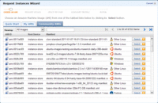
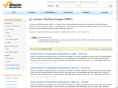
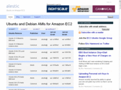

事前準備はまだまだ続きます。
EC2上でサーバーを起動するには、どのOSイメージを使うのか決める必要があります。
WindowsかLinuxぐらいしかバリエーションが無いと思ったら大間違いです。先に管理画面を見てみましょう。

AWSの面画面から、AWS Manegement Consoleを起動してください。
EC2のタブに切り替えて最初に画面のど真ん中に出てくるはずの、Lanuch Instanceのボタンを押してみましょう。

最初に出てくるのは、AMI(Amazon Machine Image)の選択画面です。仮想DISKにOSをインストールしてあるDISKイメージと思ってください。どれかを選択して起動することでサーバーが起動します。
仮想サーバーは空のDISKに自分でOSをインストールするのではなく、通常はだれかの作ったインストールイメージを使います。
Amazon自身が提供するAMIがQuick Startにあり、AmazonオリジナルLinuxやSUSE Linux、CentOS、Windows Serverなどがあります。
ただ、Small Instanceを起動したいのですが32bit Linuxが１つしかなく、しかも私の場合Ubuntuを使いたいのですが、そもそもUbuntuはありません。
Linuxを使いたいのであれば、これでは選択肢が十分ではありません。
そこで、Community AMIsというものにお世話になります。

## Community AMIs
Community AMIsタブを選択するとしばらく画面が固まってしまうのですが、辛抱強く待つと、なんと6000種類以上のAMIがでてきます。

有志でいろんな人が作ったAMIを使えるということです。
最小限のものや一通りそろっているもの、各種サーバーアプリが初めから入っているものなどなどです。

6000種類の中からどうやって選ぶか、また、どこのだれが作ったかわからないものなので、みんなが使っていて信用できる安定したものをどうやって選ぶかということになります。

Amazonが運営しているコミュニティーサイトとしてはメニューのコミュニティーを開いて、コミュニティコンテンツから行けるAmazon Machine Images(AMI)のCommunity AMIの一覧を見ることができます。

だれが作ったどんなOSイメージかがわかり、そのイメージ対する掲示板があってさまざま意見交換がされています。

それだけでは、どれが良いかはわからないので、ネット上で"amazon ec2 community ami"などで検索しまくって評判の良いイメージを探してくる必要があります。
最終的に絞られてきたらAMIの名前が"ami-xxxxxxx"というふうに振られているので、それで検索すると分かります。

AMIイメージの情報を集めて分類しているサイトもあります。

> http://thecloudmarket.com/

私の場合は、Eric Hammondという人が作っているイメージが比較的評判が良いので、そのシリーズに決めました。
ここからAMI名を探すことができます。

> http://alestic.com/

## Community AMIの選び方
AMIを選ぶときに注意すべき点は、たとえばいかのようなものがあります。

- OSの種類(Linuxディストリビューション)
- ディストリビューションのバージョン
- 32bit/64bit
- どのインスタンスタイプに対応しているか？
- ストレージはinstanceかEBSか？
- インストール済みのアプリケーションは何か？
- 評判が良いか？
- どのリージョンでつかえるか？

最後の「どのリージョンでつかえるか？」というのがなにか分からないかもしれませんが、これは料金とサイトの確認の章で説明したAmazon EC2には地域(Region)というものがあったのを思い出してください。
アメリカ東海岸、西海岸、ヨーロッパ、アジアにそれぞれ拠点があってどの拠点でサーバーを起動するかによって値段が違うというものです。AMIの作成は基本は各Regionの中で閉じています。ですから、AMIの提供者は各RegionでそれぞれAMIを公開しているのです。
Region間のAMI転送は大変なので、すべてのAMI提供者が各拠点においてくれているとは限らないのです。
すでにお話しましたとおり、一番安くて環境が整っている(すなわちAMIがたくさんそろっている)のはアメリカ東海岸なので、東海岸で使えるAMIを選択すれば間違いはありません。

ということで、作成当時の私はUbuntuの比較的新しいバージョンで基本モジュールだけが入っていて、かつ安定して評判の良いAMIとうことで、Alestic.comシリーズの中からスモールインスタンスで使える32bit版を選びました。外付けDISKのEBSはなしです。
最近の状況はわからないので、やはりネットで検索しまくるしかありませんね。

ちなみに、自分でインストールしたLinuxを使えないのか？という疑問に戻るのですが、Communityの人たちがやっているのでもちろんできるのですが、そもそもインストール先のマシンが存在しない状況でイメージを作ることが一般の人にはできないと思います。私もできません。VMWareなどのように仮想ディスクを作って仮想マシンを設定してという作業がEC2側にできないですから。
手元で作ったイメージを送るにも、どういう環境を手元に作れば良いのか？転送の課金がどれだけかかるのか分かりません。
気持ちが悪いという人もいるかもしれませんが、今のところ誰かの作ったイメージを使うのが得策のようです。
