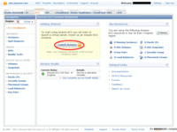

やっとお待ちかねのサーバーセットアップです。

ここまでの準備で決めてきたことを整理して控えておきましょう。

1. ブラウザーは念のためFireFoxを使用(慣れたら他でもOK)
2. セットアップするリージョン(地球上の置く場所)を値段と使い勝手と相談し決めておく
3. あらかじめ使用するOSイメージを決めておいてAMI名を控えておく
4. インスタンスタイプ(仮想マシンの規模・種類)を決めておく
5. 基本はKey pair生成は１回だけにする

ここにあげた順番でセットアップ画面で聞かれます。
この章から読んで意味が分からない方は、前の章を呼んでくださいね。

## インスタンスとは
そもそもインスタンス(Instance)とは何でしょう。
(ここではEBS bootではなくinstance-storeの場合について記述します）

これまでの話の中で大体は分かると思いますが、ここで短くまとめておきます。
Amazon EC2ではみんなに公開しているいろいろなタイプのOSイメージを、各マシン用の仮想ディスクに論理的に読み込んで、それを起動します。しかしこの仮想ディスクはRAMディスクのようにマシンをシャットダウンすると消えてしまいます。
仮想マシンの実体である、仮想ディスク、仮想メモリー、仮想デバイスのすべてが、起動したときに生成され、シャットダウンすると消滅します。
この仮想マシンをインスタンス(Instance)と言います。

仮想マシンをセットアップしてサーバーを起動すると言うことは、インスタンスを作成して起動するということになります。

## Firefoxの準備
前の章で書きましたが、使用するWebブラウザーが「Internet Explorer」ではうまくいかない場合があります。
Wizardの中でKey pair生成をする場合は、なるべくFirefox(またはChrome)を使用してください。
すでにKey pair生成を終わらせている場合はWebブラウザに惑わされることは無いはずです。いつもお使いのブラウザでどうぞ。

## EC2管理画面表示
では作業開始です。
AWS管理画面はAmazon Web Servicesメインページのヘッダー部分にリンクが張ってあります。

おそらく既に管理アカウントでログインしてあってもタイムアウトしていて再度ログインを要求されると思われますので、登録したAmazonのアカウント(メールアドレス+パスワード)でログインしてください。

管理画面を開くとEC2タブがあるので選択してEC2の管理画面を開いてください。

## リージョンの選択
EC2の画面の左上に管理するリージョンの選択メニューがあります。

各リージョンごとにばっさり画面を切り替えてしまうのでリージョン間の関係が疎結合である事が分かります。
今回は米国東海岸側を使うので「US East」側を選択したとして話を進めます。

## インスタンス起動ウィザード
EC2 Dashboardの真ん中にある「Launch Instance」を押すとインスタンス起動ウィザードが始まります。

## Community AMIs
起動すると初めはAmazonが用意したInstanceの起動イメージの一覧が表示されますが、ほぼ使わないのでさまざまなCommunityが作っているイメージを使うことにします。
前の章であらかじめ決めてあるので、Community AMIsをタブを選びしばらく辛抱すると、6000個以上のイメージの一覧が出てきます。

## AMIとInstance Typeの選択
一覧では多すぎるのであらかじめ調べておいたイメージの名前である、AMI名を指定して検索しましょう。
今回は私が使ったAlesticが作ったUbuntu 8.04 LTS Hardyのinstance-storeイメージを使います。
(かなり古いのですがだいぶ前のことですから)
今であればUbuntu 10.04 LTS Lucidあたりが無難ですね。

AMIの決定は中に見は入っているインストール済みOSのバージョンの他に、そのAMIので起動できるインスタンスタイプの範囲が決まってしまいます。
たとえば「ami-6836dc01」というAMIは、インスタンスタイプが「small」か「High-CPU Medium」でBootタイプがinstance-storeのみ利用できます。
これは各コミュニティが作ったそれぞれのAMI固有の仕様です。

これらを踏まえ前の章で決めてあると思いますので、検索欄にAMIの名前を入れて表示し「select」しましょう。

すると起動するInstance Typeが表示されますので、選択してください。ここでは前の「料金とサイトの確認」の章で記述した理由でSmallを選びます。

## オプション関係
細かいオプションはいろいろあるようですが、とりあえず飛ばします。

## Key pair選択
Instance生成Wizardの中でKey pairの生成も行うと決めた方は前章は読み飛ばしているので、ここで前章のKey pair生成からダウンロードおよびKey pairの変換などを行ってください。

前の「Key pair生成」の章の作業を済ませている方は、ここでは「Choose from your existing Key Pairs」から既存のKey pairの選択だけで先に進めることが出来ます。

## Firewall設定
Amazon EC2ではサーバーがインターネット上にさらされるため、ファイアウォールで必要の無い通信をブロックしています。
Windowsの世界でいうところのパーソナルファイアウォールみたいなものです。Unix/Linux系でも直接マシンにインストールいて保護するFirewallがありますね。
Amazon EC2ではOS側で対応しなくとも仮想化の仕組みの中でインスタンスごとにファイアウォールを設定できます。
それを一つ一つ細かく設定するのは大変なので、Security Groupというテンプレートを使って設定を一元化しているので、そのテンプレートをこの画面では作ります。

まずは、マシンにログオンしなければいけないのでsshを許可するSecurity Groupを作成します。
「Create a new Security Group」を選択して、適当にGroup Nameと説明書を入れ、許可するInbound RulesとしてSSHを指定して、Source IPアドレスに自分の家や会社の外部IPアドレスを設定します。
会社の場合はネットワークの都合がどうなっているのかまちまちで分かりませんが、自宅でたとえるならインターネットルーターの外部IPアドレスをしていする事になります。

もしろん全てのアドレスからSSH接続してもいいという風に設定してもいいのですが、その辺のリスクテイクはちゃんとしたほうがいいです。

「Add Rule」追加されて表示されていきます。

あらかじめ使うプロトコルをすべて設定しても良いのですが、まだなにもやっていないうちから穴だらけというのも良くないので、初めはSSHだけを許可しておくのが無難です。
よければ「continue」で先へ進めましょう。

## Instance作成完了
最後に確認画面が出てきて「Launch」を押せば作成され起動します。

現在動作中のInstanceの一覧が画面左Navigationの「Instances」から見ることが出来ます。

## 固定IPの設定
Instanceは起動するたびにIPアドレスが変わってしまいます。それでは使い勝手が悪いというか、インターネット上にサーバーを公開するには困ってしまいます。
ですから、EC2内部ネットワークから見て外部のインターネット上の固定IPへアドレス変換をして、サーバー公開してくれる仕組みが備わっています。
これが「Elastic IP」です。

画面左Navigationの「Elastic IPs」から設定できます。

「Associate New Address」をすると、IPのタイプを聞いてきます。今回はEC2用なので「EC2」を選んでください。

割り振られた固定IPがElastic IPの一覧として表示されます。このIPに起動中のInstanceを割り当てます。

選択してElastic IPを選択してメニューから「Associate Address」を押す

すると、起動中のInstanceを選ぶリストボックスが出るので選んでください。

これで、Instanceに固定IPアドレスが割り当てられました。

Webを公開したときのIPアドレスはもちろんですし、sshの接続先としてもこの固定IPアドレスが使えるようになります。
Instance自身は停止してまた始動するとIPが変わってしまいますので、またこの固定IPアドレスに割り当てれば、
対外的にはIPアドレスが変わっていないように見えます。

ちなみにこの固定IPサービスの基本使用料は実質無料です。
ただし、Instanceに割り当てられていない時間の分だけ課金されます。
サーバー立てる前に先に固定IPだけ取っちゃえという場合には課金しますよって言うことです。

## 起動したサーバーへログイン
Instanceは起動た事になっていますが、まだログインしていないのでほんとかどうか分かりませんね。

sshを使ってconsoleにログインします。

今回はPuttyを使います。お手持ちの使い慣れたSSHのクライアントを使用してください。

起動したら普通に接続先のIPアドレスを入力するわけですが、このIPアドレスはInstanceのIPアドレスでもいいですし、Elastic IPの固定IPアドレスでもかまいません。
こなれてきたら固定IPになると思います。サービスはSSHですね。

そしてここで、すぐに「open」は押さずに、前の章で作ったKey Pairを指定するですが、PuTTYの場合CategoryのConnection→SSH→Authの項目の「Private key file for authentication」で指定します。

そしたら、「open」で接続しにいってください。

ここから先は、選んだAMIの仕様しだいなのですが、2011/7/11現在のAlestic.comの公開しているイメージではユーザーubuntuでログインするようになっているようです(昔はrootでした)。
ログインユーザをタイプしてEnterを押すとPPKファイルの保存時に指定したパスフレーズを聞かれKey pairのやり取りが行われてログインします。
ちなみにPPKファイルを保存すときにパスワードをつけていないので聞いてきませんが、PPKにパスワードをつけていればPPK使用時に聞かれます。
