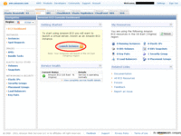
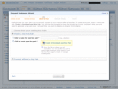
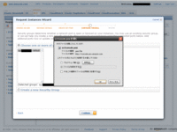
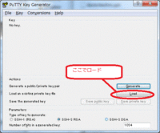
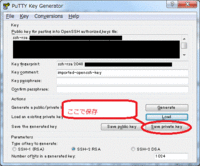

Amazon EC2におけるセキュリティ証明書がなんとなく分かって頂けたところで、早速今回のEC2サーバーセットアップに必要なKey pairを生成しましょう。

と書きたかったのですが、いろいろ考えた所、逆に手順が複雑の感じてしまう人もいるかもしれないと思いました。

- 絶対にKey pair生成(正確にはダウンロード)に失敗しない自信がある人は、この章は最初は読み飛ばして、インスタンス生成後に読んでください。Amazonが用意したInstance起動Wizardにそって作業することになり流れ作業になりますが、Key pairのダウンロードに失敗したりすると途中で思考が寸断されて分からなくなります。

- Key pair生成(正確にはダウンロード)に失敗してアタフタしてしまいそうな人は、この章を先に読んで実施してください。心配事を先に済ませてしまうのでInstance起動Wizardを安心して進められますが、本来のAmazonの用意した手順とはすこし異なります。

ということで、お好みのほうを選んでください。

では、Key pair生成を先に済ませてしまいたい人は、さっそくはじめましょう。

ここで行うことは、前の章ですでに書いたとおり、本来はInstance生成をする画面で先にKey pair生成だけ済ませてしまおうというものです。

この章で生成するのは

+ 生のままのKey Pair(Amazon EC2の一対の鍵)

です。
日本語画面では「一対の鍵」と表現されているのですが、何のことだか分かりませんし、この文章を書いている時点ではEC2の管理画面は英語のままなので、Key pairという表現を使うことにします。

## Key pair生成の概要
今回起動するLinuxサーバーにはsshという安全な通信でLinuxの管理画面に接続するのでそのために使用します。
sshは本来パスワードなどを使って接続認証する事もできるのですが、AmazonEC2ではそれを許していません。かならず公開鍵暗号方式の認証でなければならないのです。
そのために生成するのが前章のインスタンス起動時に指定するコネクション認証キーにあたる、Key pair(一対の鍵)の鍵です。

通常はKey pair生成をインスタンス作成のウィザード画面の中でおこなう手順で説明するはずです。
最初はいろいろな管理画面を使うよりも１つの画面でとりあえずます最初に起動するところを見たいであろうと言う事を考慮しての手順です。
ただし、この手順に失敗したときにどうすれば良いか迷うはすです。一度失敗したら次は臨機応変に対応しないといけないからです。

と言うことで、この説明ではウィザードを起動する前に、Key pairの生成とダウンロードを先に済ませてしまう方法で説明をしています。

## Firefoxの準備
「管理者PC環境の準備」の章で書きましたが、使用するWebブラウザーが「Internet Explorer」ではうまくいかない場合があります。
生成したKey pairは生成した瞬間の一度しかダウンロードすることができませんが、Internet Explorerでは、セキュリティ設定が厳しいためダウンロード操作がブロックされて、それを許可してからあらためてダウンロードという動作をしようとします。
しかしそのときには、すでにKey pairは一度ダウンロードを試みられた後ですので、二度目のダウンロードを試みようとしてもできないと言う理由です。

「Mozilla Firefox」では、その辺は寛大で中止か続行するかを聞いてきます。続行することで一度のダウンロード試行で、管理PC上にKey pair(一対の鍵)を取り込む事ができます。

ちなみに、Google Chromeでも問題が起きずに出来るようです。ただしChromeは高速に表示する事に特化しすぎていて、画面のキャッシュを必要以上に利用している場合がたまにあります。
私も画面キャッシュのせいで、本来の動作が分からなくなり混乱したことがあります。ですからChromeほど頭の良くないFirefoxのほうが、key pair生成には向いているのかなぁと思っています。

もちろん普段の私はこの作業以外でAWS Managment Consoleを使うにはChrome問題なく使えていますし、Internet Exploreでもとくに困ったことはありません。
それどころか私は普段Chromeを使い、Firefoxはまったく使っていません。

「Mozilla Firefox」はこちらかダウンロードできます。

> http://mozilla.jp/firefox/

## PuTTYの準備
起動したLinuxにログインするためsshを使いますが、このクライアントソフトは今回puttyを使います。
理由は特にありません。私が他を使ったことがないからです。普段お使いのsshクライアントがあればそれを使った場合に読み替えてください。

puttyはこちらからダウンロードできます。

> http://www.chiark.greenend.org.uk/~sgtatham/putty/

## AWS Managment Console作業
では生成を始めましょう

再度念を押しますがここから先は、Instance生成の作業そのものをKey pair生成までやって途中でやめるという作業です。

後の章と「同じ様な」画面をたどるという風に勘違いしないでください。「同じ」画面です。

ということで、Instance生成との違いのメリハリをつけるために、全ての画面ショットはつけないことにします。
もし画面を見ながら出なければ出来ない！という方がいれば、先にInstance生成の章の画面で、Key pair生成画面に到達する流れを見てください。

流れの概要としては、

1. すべてダミーの情報をいれて、Key pair生成画面まで進める。
2. Key pairをダウンロードする
3. PPKファイルを作成する。

key pair生成が目的なので、Instanceに関する情報はすべてダミーでかまいません。

早速、管理コンソールを表示してみましょう。

- メインページであるhttp://aws.amazon.com/jp/に戻って、画面上の「AWS Management Consoleを利用する」を押すと、管理コンソールが表示ます。
- 上の機能タブに「S3」や「EC2」や「VPC」などという名前がみえます。このうち「EC2」を選んでください。
- 画面左のNavigation部分の機能タブのすぐ下の所に「Region」があります。ここが前の章で書いたように「US East」であることを確認します。なぜAsia Pacific(tokyo)でないのかと思われる方は、「料金とサイト」の章をご覧ください。Key pairの管理はRegionごとに異なります。
- ここまできて、画面中を中央の「Launch Instance」というボタンを押すと、Instance生成画面画がはじまります。

Key pair生成画面まで進めます。中身は本当に何でもかまいません。
- Instance生成Wizardが立ち上がったら、実際の構築の気分に合わせて「Community AMIs」を選びます。
- 非常に時間がかかりますが待っていると一覧が出てくるので、実際に合わせてUbuntuのどれかを選び「Select」ボタンを押します。
- そこから何も入力せず「Continue」ボタンを３回ほど押すとKey pair生成画面が現れます。画面上のほうのWizardの進行状況が「Create Key Pair」になるまで進めてください。
- 「Create a new Key Pair」を選びます。これで新規にKey pairを生成しダウンロードできます。

では生成＆ダウンロードします
- Enter a name for your key pairに入力して生成するKey pairに名前をつけます。今後AWS Management Console上ではこの名前が使われます。
- 入力したら「Create & Download your Key Pair」を押します。するとダウンロードが始まり、ブラウザのダウンロードダイアログが出ます。今回はFirefoxを使っています。たとえばec2consoleという名前をkey pairにつけているとec2console.pemというファイル名でダウンロードされます。
- ダウンロードできたらWizardは右上の「cancel」などで中断してください。

このブラウザのダウンロード画面できちんと手元のＰＣにkey pairをファイルとしてダウンロードしておく必要があります。
Internet Exploreでブロックされロードの再試行がされると失敗します。キャンセルを押してしまってもだめです。
もし失敗していたら「EC2」画面の「Launch Instance」からやり直せば問題ありません。

## key pairファイルの変換
では、ダウンロードしたファイルを後で使うPPKファイルの変換しましょう。

- ダウンロードしたファイルはPEMファイルという形式(拡張子PEM)で手元のＰＣに保存されるはずですので確認してください。
- puttyの中のPUTTYGEN.EXEというツールを起動してください。

- 「Load」ボタンを押して、ダイアログが出たらファイル名の右のファイルの種類を「All Files」にしてください。PEMファイルも表示される様になります。ここでPEMファイルを指定しロードします。
- 私のputtyでは「Successfully imported foreign key」とポップアップが出たあと中身が表示されます。
- 「save private key」でPEMファイルをPPKファイルに変換して保存してくれます。保存する前に「Key passphrase」にパスフレーズ(パスワード)を指定しておくとこのPPKファイルを使うときにパスフレーズを聞いてくるようになります。

PPKファイルは、後にputtyを使ってInstanceに接続しLinuxにログオンしたり、psftpを使ってファイル転送をしたりするときに使います。
このロード/セーブがうまくいきPPKファイルが生成できる状態であれば、Key pairのダウンロードはほとんどの場合うまく入っているといえます。

今後、AWS Management ConsoleのInstance生成Wizardでは、いま生成したKey pair名を既存のKey pairの中から指定すればダウンロードの失敗に惑わされず進めることが出来ます。
