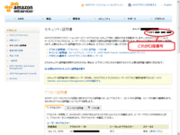

「セキュリティ証明書の理解」章で説明したとおり、S3へのアクセスやツール類を使うときにAmazon Web ServicesのAPIで必要となる「アクセス証明書」という物を使います。作業を始める前にまずこれらを準備しましょう。

## アクセスキーIDとシークレットアクセスキー
通常の場合はS3に接続する時に、Access Key ID(アクセスキー ID)＋Secret Access Key(シークレットアクセスキー)を使います。

では早速取得してみましょう。Amazon Web Servicesのトップページから「セキュリティ証明書(Security Credential)」のページを開きます。
※このページのレイアウトがしょっちゅう変わるので何処からとは言えませんがこれを書いている時点では右上のプルダウンメニューから選べます。

３つある中の「アクセス証明書」のところにさらに３つあり、その中の「アクセスキー」が今回使用するものです。
ここには、Amazon Web Servicesのアカウントを作成したときに最初にアクセスキーIDを予め生成してくれているようです。
アクセスキー IDは表示されているもの、シークレットアクセスキーは「表示」の部分をクリックすると表示されます。

このアクセスキーはS3専用というわけではなく、Amazon Web Servicesのさまざまなサービスを使う時のAPI群に利用するものです。

## X.509証明書
さて困ったことにこれだけでは足りません。
バックアップイメージを起動可能な状態にするツールを使う為にX.509証明書を使います。アクセスキーもここのX.509証明書も、どちらもAPIを使うときにAWSアカウントを表す認証キーなのですが、後述するAWSの標準ツールではコマンドによって使い分けなければならないという煩雑な状態になっています。
EBSを使っていてAWS Consoleだけしか使わない人にとってはX.509証明書はお目にかかる必要がないんです。
文句を言っても仕方ないので隣のタブでX.509証明書を取得します。

「X.509証明書」のタブを選択して「新しい証明書を作成する」をクリックしてください。

するとPrivate KeyとX.509証明書が作成されます。
この２つは必ず組で使います。したがって表示されたダウンロード画面を閉じることなく確実に２つともダウンロードしてください。
SSHのキーペアをダウンロードしたときと同じでダウンロードに失敗してしまうと同じPrivate Keyをダウンロードすることは出来ません。
必要に応じてFireFoxなどのブラウザを使い分けてダウンロードしてください。

もし失敗したら「無効にする」で使えないようにしておくことで失敗した証明書かどうかを区別できるようにしておいてから、もう一度新しい証明書を作成すればよいでしょう。
ダウンロードするとファイル名はそれぞれpk-XXXXXXXXXXXXXX.pemとcert-XXXXXXXXXXXXXX.pemになります。
この２つのファイルも大事に保存してなくさないようにしてください。

## Account Number
最後にユーザーの口座番号(Account Number)を確認し、これも後で使用します。日本語で口座番号と書いてあるので分かりにくいのですが要するにアカウントナンバーです。
アクセスキーIDやX.509証明書で認証を行いますが、最終的にはこのアカウントナンバーを特定するための手段です。

