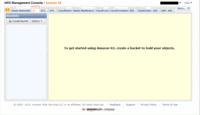

本当はここでAmazon S3 OrganizerというS3の管理をグラフィカルにするためのFireFoxプラグインを紹介するはずだったのですが、その必要がなくなってしまいました。
AWS Consoleの中に同じ機能の画面が出来たのです。

昔はS3の管理をする画面が無くてコマンドかAPIで操作するしかありませんでした。管理画面が標準機能になったおかげでFireFoxいらずになりました。
ということで、AWS ConsoleからS3タブで管理画面が表示されます。

