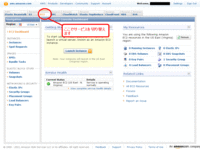

## EC2の使用に必要なアカウントの登録
では利用のためのアカウント作成と申し込みをしましょう。
すべての申し込み作業はオンラインで行うことができます。
作業を始める前に３つ用意してください。

- EC2の利用料支払いに使うクレジットカード
- 国際電話を着信できる電話(携帯電話でもかまいません)
- ユーザーアカウントとして使う電子メールアドレス

作業の大体の流れは以下のようになります。
実際に作るのはAmazon.comのユーザアカウント、Amazon Web Serviceへの登録、Amazon EC2への登録、の３つになります。

Amazon.comのユーザアカウントは米国Amazonのショッピングサイトのほうで通常の買い物画面で使うユーザーアカウントと共通の取り扱いになっていて、EC2利用の為に作ったカウントで米国Amazon.comで買い物もできますし、アフィリエイトもできます。

そのアカウントでAmazon Web Serviceの利用登録をします。EC2はこのAmazon Web Serviceの中の１つで、S3やEBSのほかさまざまなサービスがあります。
たとえば、ショッピングサイトのデータを取ってきたり決済したりするための無料のAPIなどもこのAmazon Web Serviceのひとつです。

登録したAmazon Web Serviceのアカウントを使いEC2の利用登録をします。EC2は有料サービスなのでここで初めて支払い情報を登録することになります。

これらをいっぺんに登録することもできるのですが、分かりやすいように最初の２つのアカウント登録と、EC2への登録は分けて行いたいと思います。
あとの章で出てくる電子証明書は、EC2ではなくAmazon Web Service全体に共通する電子証明書なので、分けて考えたほうが分かりやすいのです。

登録作業はこのようになっています。

- Amazon.comおよびAmazon Web Serviceのユーザーアカウントの作成
 - メールアドレスの登録(ログインに使います)
 - 個人情報の登録(住所、電話番号など)
- EC2の利用情報の登録と本人確認
 - クレジットカード情報
 - EC2の身元登録(再度住所、電話番号など)
 - 電話による本人確認

では、はじめましょう。

## Amazon.comのアカウントの作成とAmazon Web Service登録
まずはアカウントを作りましょう。
すでにお話したように２段階のアカウント登録が行われます。

- amazon.comへのアカウント登録
- amazon.comに作ったアカウントのAamazon Web Servicesへの登録

EC2/S3用に作ったアカウントでショッピングもできてしまうので、アカウント管理はよく考えてください。
個人ならどうでもいいことですが、おそらく会社で利用したいという人が多いと思いますので、違う目的で勝手に使われないように人的工夫が必要です。
また、すでに米国Amazon.comのショッピング用アカウントを持っているのであればそれを使うこともできます。

さて、最近は日本語が充実してきたので、Amazon Web Servicesも多少は日本語ページがあります。
http://aws.amazon.com/jp から、「今すぐ申し込む(Sign Up Now)」ボタンを押して登録を始めましょう。

新規登録ならメールアドレスを入力して、I am new user.を選択してください 。この画面ではパスワード入力はしません(既にamazon.comでお買い物をしているアカウントを使うならI am a returning user
and my password is:を選択してパスワードを入れてください)

次のページに行くともう一度メールアドレスの入力が求められます。前のページと同じアドレスを２回入れて、パスワードを決めて入力してください。
今後ログインするときはこのメールアドレスとパスワードを使います。

次に個人情報の登録になります。住所、電話番号などを入力してください。必須項目でない場所は空欄でかまいません。
ここの電話番号は後から本人確認に使う電話番号でなくてもかまいません。連絡先として登録してください。

利用規約に承諾すると、Welcome, XXXXX, to Amazon Web Services!となって、アカウント登録の完了です。
ここでこの先何をすればいいのか、分からなくなるのですが、いったん最初のページに戻りましょう。
http://aws.amazon.com/jp です。Amazon Web Serviceのタイトルアイコンを押せばいいでしょう。

上のメニューの一番右から「アカウント(Account)」→「個人情報(Personal Information)」
を見ると今登録したアカウントの情報を見ることができます。

正しく登録されているか確認しましょう。
ここまで最初に挙げた２段階のアカウント登録ができました。これでAWS管理画面を見ることはできるのですが、EC2/S3を使うことができないので、もうちょっと待ってください。

## Amazon EC2の利用の申し込み
つぎにEC2への利用登録を行います。
EC2は有料サービスなのでクレジットカード情報の登録があります。
注意点は今登録したユーザーでのログイン状態がうまく保持できない場合があり、途中でログインを求めてくる場合がありますが、あきらめずその場で何度もアカウントのメールアドレスとパスワードを入力することで先に進めることができます。

- クレジットカード情報入力
- EC2の利用者情報登録(再度住所などを登録します)
- 電話による本人確認

メインページからAmazon Elastic Compute Cloud (EC2) をクリックしてaws.amazon.com/jp/ec2を開きましょう。
または上の「製品」メニューを開いてAmazon Elastic Compute Cloud (EC2) をクリックしてもかまいません。

これがEC2のトップページです、「Amazon EC2の利用を申し込む(Sign Up For Amazon EC2)」を押して登録を始めましょう。

ここでクレジットカード情報を入力します。
最初に価格の説明が長々と説明してありますが、これは前の章で説明した内容です。
さっと読み飛ばしてページの最後にクレジットカード番号を入力します。

EC2サービスの利用者情報登録をします。すでにAmazon Web Serviceの登録で入力した住所が表示され選択できるようになっているので、それを使えばよいです。
(画面は省略します)

つぎが本人確認ページです。
本人確認の為に電話番号を入力します。国際電話でかける場合の番号を入れてください。国番号81は選択になっているので、そのあとにたとえば、東京なら3+1234+5678のように市外局番の0を除いて入力します。
入力してボタンを押すと、電話中という表示とともに、そこに電話がかかってきます。英語ですが、自動音声なので安心してください。
画面上では数字の認証コードが表示されています。
電話をトーンダイアルにして画面に表示されている認証コードをダイアル入力してあげると、認証しました、という意味の事を言って電話が切られます。
すると次にすすんで画面が変わります。
(画面は省略します)

最後の確認画面ですが、とくに何もないので「サインアップの完了」で申し込みを完了してください。

完了すると、登録アカウントのメールアドレスにメールが送られるよという画面が表示されます。

メールを見てみましょう。
メールが何通か届きました。
EC2に登録すると、同時にS3やVPC、そしてNotification Serviceなども同時にセットで登録されるためです。
同時にS3の利用申し込みもされているということです。
EC2の内容を見てみると、申し込みが完了したよと書いてあります。
また、アクセスキーについての記述があります。これは次の章でお話します。

早速、管理コンソールを表示してみましょう。
メインページであるhttp://aws.amazon.com/jp/に戻って、画面上の「AWS Management Consoleを利用する」を押すと、管理コンソールが表示ます。

S3の画面が最初に表示されていますが、タブ切り替えでほかのサービスの管理画面も表示することができますね。
EC2のタブを選んでみましょう。それらしい管理画面が表示されるはずです。
ここで、S3やEC2が有効化されていないと出て、申し込みボタンが表示されていると、登録がうまくいっていないということです。
もう一度、この申し込み手順を確認してやり直してみてください。

おめでとうございます。これで、アカウント登録の完了です。
