たまにしか、手をつけませんので、ほとんど進みませんが、これまでの状況は以下
のようになっています。

### 2013/01/29

もろもろバグフィックスと、もろもろ下準備で更新。

### 2013/01/26
CD-ROMを使えるようにドライバーを作成しました。

ATA/ATAPIドライバーとiso9660ファイルシステムをサーバーとして実装しています。

まだテスト段階で、マルチセッションやUDFとかRockRidgeなどの拡張フォーマットを全く考慮していないため、想定外のフォーマットに出会うとどのような動きになるかは分かりません。

またCDROMからのBootなどもまだできません。

VMWareとVirtualBoxのATAPI接続で仮想CD-ROMのISOファイルをマウントしてテストしています。

ISOファイルの作成にはCdrtoolsを使っています。

Cdrtoolsは以下のURLからWindows版のバイナリーをダウンロードしています。

> http://www.student.tugraz.at/thomas.plank/index_en.html

ビルドする前にMinGWの実行パスが通ったディレクトリにコピーしておいてください。

最新バイナリーにはフロッピーディスクとCD-ROMに実行プログラムのすべてを入れてあります。

CD-ROMからはブートできないのでフロッピーディスクからブートしてください。

CD-ROMアクセスしている様子を見るには、CD-ROMをマウントし以下の様にコマンドを実行します。

    o(^^)o>atad &
    o(^^)o>cdfsd &
    o(^^)o>tstcdfs dir /

これでCD-ROMのルートディレクトリが見えます。

tstcdfs では以下のテストが出来ます。すべてフルパスで指定してください。

- tstcdfs dir [-p] [-a] ディレクトリー名
  - 機能：ディレクトリ表示
  - オプション:
    - -p : ページング
    - -a : Hiddenファイルの表示

- tstcdfs type ファイル名
  - 機能：テキストファイル表示

- tstcdfs stat ファイル名
  - 機能：属性情報表示

- tstcdfs exec ファイル名
  - 機能：ファイル実行

適当なISO形式のCD-ROMファイルをVMWareにマウントして表示してみてください。

DMAモードではなくPIOモードでアクセスしているためかなり遅いです。

DMAにすべきですね。どうやらUltra-DMAモードを使うにはPCIバスの利用が前提のようです。

PCIもサポートしなければならないとなるとハードルが高いですね。

[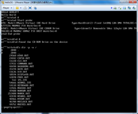](img/helloscreenshot20130126.png)

### 2012/09/21
gcc 4.7.1に対応しました。

懸念していたとおり最適化の関係で動かなくなりましたので、pragma GCC optimizeを使って制御するように変更しています。

このoptimizeの制御はgcc 4.4以降でないと出来ないので、これまでGCC 4.2を使っていたためこの制御が出来ず綱渡りで動くようにしていました。

GCCのバージョンアップで晴れてちゃんとoptimize制御が出来るようになりました。

(そうしたら昨日4.7.2が出てなんて悪いタイミングにあげちゃったかなと。gccのビルドは大変なので4.7.2は見送りです。)

これとは無関係ですが、VMWare Playerをver.5にバージョンアップしたら、かなり遅くなってしまいました。アイドル状態でもホストマシンのCPUが消費されます。ver4では問題ありませんでしたし、VirtualBoxでも問題ありません。

またこの現象はWindows XPを仮想マシンで動かしても起きないので、HelloOSと何かの相性が悪いようです。

そしてnano-Xもとても遅くなってしまい、VirtualBoxより遅い動作です。

困りました。

### 2012/08/23
MicroWindowsをversion 0.92にアップグレードしました。

画面の非矩形ウィンドウ(xeyesやペンギン)がおかしいのは直りましたが、skip blitというエラーが多発しているのでsrvfunc.cの該当部分のエラー表示をコメントアウトしてあります。エラー時は画面の乱れが残ります。

これはMicroWindowsの問題に見えて根が深そうです。

デバッグのためにpsコマンドにCPU使用率を表示するようにしました。計測のために1秒間待ってしまうのでモサッとした感じです。このためにカーネル側でも計測機構をいれたので、あとでタスクのスケジューリングに使えるかもしれません。

現在のタスクスケジューリングは割り込みを受けたりキューイベントを受けたりすると最優先で切り替わるのと、一定時間動いたらタイマーで強制的に切り替わるだけで、プライオリティの判定は全くしていません。

フロッピーディスクドライバーにも問題が残っています。デモのworldで負荷をかけると動作がおかしくなります。Mutexで排他処理をしたのですがまだだめです。

そもそもプログラムロードのためにカーネル内に残してあるので、カーネルの外に出したらちゃんと調べようと思います。

とりあえずworldを改造してマップファイルを一気にメモリーに読むように変えてしまいました。

その他多数のOS側のバグを取ったのでウィンドウシステム周りはこれぐらいにしておこうかと思います。

MicroWindows(というか今はNano-Xのほうを正式名にしているようです)のおかげでOS側にいろいろな機能がつきました。それだけでも十分な収穫です。

仮想端末部分をちゃんと使えるようにするか、ウィンドウシステムのノウハウを頂いてさらにライトウエイトなものを作るかどっちか迷いますね。

[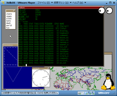](img/helloscreenshot20120823.png)

### 2012/08/17
MicroWindowsをサーバープロセス化しました。

これのためにSocketに似せたインターフェースを共有メモリーを使って実現。Socketは意地でもカーネルには実装したくないので。

MicroWindowsの中のNano-Xを実現しています。

これが出来ると複数プロセスで利用できるので一気に開発が進みます。

カーネルやユーザーライブラリーをいろいろ強化してでもプログラムを移植しました。

カーネルでは浮動小数点サポートをできるようになりました。

そしてなんといってもXTermの移植は大きな節目です。これのためにコンソールセッションの概念を取り入れました。

リアルタイムクロックとシステム時刻のUNIX互換も大きな変更です。

プログラムの移植を考えるとUNIXとある程度互換性があったほうがやり易いです。すべてゼロからアプリケーションを組むのは大変ですから。

画面は一気に派手になりました。

[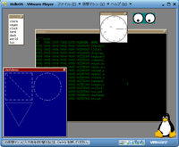](img/helloscreenshot20120817.png)

まだ画面の乱れがありバグが多いです。

### 2012/07/11
MicroWindowsの移植作業を進めました。

Windowライブラリーとしては何とか動作しているようです。

サーバープログラムではなく静的なライブラリなので１プロセスからのみ利用できています。

MicroWindowsのコードは高速化のせいかグローバル変数が複雑に入り組んでいて非常に見にくく、しかもスタティックな変数はすべて初期化されていることが前提だったりと、今回の開発環境とは合わない所が多いので、まだまだ移植によるバグが潜んでいそうです。

680x480x8の動作モードのみ移植してあります。

クライアントサーバーにするにはUnix Socketを前提として作られている部分をどう移植するかが今後の課題です。

MicroWindowsについてるデモプログラムを動かすとこのような感じです。

[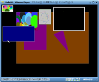](img/helloscreenshot20120711.png)

今回はVirtualBoxとVirtual PCでの動作確認もしました。

これに伴い、VESAモードの物理アドレスを論理アドレスにマッピングしてアクセスする方式に変更し、ハードウェア間の相違をCPU側で吸収しています。

VirtualBox上での動作は非常に遅く、マウスがモサッと動きます。

### 2012/03/20
1年半ぶりに更新しました。

禁断のVESAモード対応です。

680x480x8でコンパイルしてあります。

8bitすなわち256色モードであれば他の解像度でも対応しています。

解像度を変えたい場合はsetup.cのモード指定を書き換えてコンパイルしてください。

VESA BIOSで、しかも32bitから16bitへ戻ることが出来ないので、起動後に解像度を変えることが出来ないし、テキストモードとの行き来も出来なくなってしまったため、スクリーンショットで分かるとおりbitmapで文字を書いています。

結果としてkernel上にtextフォントイメージを取り込むことになってしまいました。

Displayサーバー起動後はDispalyサーバーで文字描画をしているため究極の形としてはkernelは文字表示をしないってことも出来るのですが、それだと開発上面倒なのでkernelにも文字表示機能を持たせています。

開発環境がWindows 7になってしまったため、テストはVMWare Playerのみで行っています。その他の仮想環境を作るのが面倒なので。

Window System実装はまだ遠い。。。。

[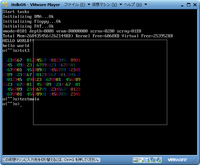](img/helloscreenshot20120320.png)

これでTEXTとVGA-4Plane前提としている旧Windowsシステムは動作しなくなりました。

### 2010/09/30
ウィンドウシステムがうまくいかなくて進まないので、MicroWindows移植をたくらんでみました。

最初から関心はあったのですが、なんとも手がつけにくいソースだったので断念してたものです。

移植というより例によって再利用的な感じで組み立てていくことになります。すでに原型をとどめていないかも（笑
まずは、ドライバー部分を動かすことが出来ました。もちろんVGA Plane4です。VGAコントローラのパラメーターがどうも納得いかなくてテキストモードに戻すところは前面書き換えです。

画面は例によって、面白くない四角が一つ表示されているだけ。これをだすのにどれだけ時間がかかったか分かる人にしかわからないでしょう。

[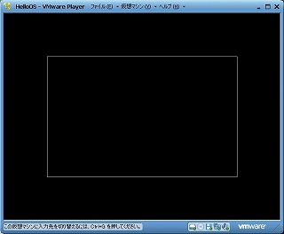](img/helloscreenshot20100930.jpg)

### 2010/04/11
1年以上、放置していたのですが、ちょっとだけ更新します。

VMWare PlayerがVer.3.0になってDiskイメージが作れたり、いろいろとまともになってきたので、対応しました。
ただし、Mouseドライバーを書き換えただけです。

とは言っても、VMWareは異常にVRAMアクセスが遅いので、まともに動いているというには程遠い状態です。

VMWareは専用ビデオドライバーを開発することが前提となっているエミュレータといえますね。

### 2009/03/29
ずっとWindowサーバーのバグになやまされています。どうもスタックを壊してしまうようで訳の分からない動作をしています。

そんな中、なんとか動くようになり、タイトルを表示できるようにWindowのオープン時に指定できるようにしました。ウィンド枠やタイトルはすべてウィンドマネージャが描画するように変更しました。

バグの正体はまだ不明です。画面は相変わらず変わらずこんな感じ。

[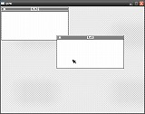](img/helloscreenshot20090329.jpg)

### 2008/09/15
ウィンドウマネージャを作ってウィンドウの移動できるようにしました。まだまだマウスイベントがうまく整理できていませんが、
なんとか動いています。

ここで気が付いたのですが、Virtual PCでは処理が重たくなりすぎて、動かなくなってしまいました。

QEMUを使って試してください。以下をバッチファイルにすると簡単に起動できます。

    qemu.exe -L . -m 4 -localtime -std-vga -fda hello.img 

[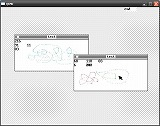](img/helloscreenshot20080915.jpg)

### 2008/08/24
マルチウィンドウシステムをサーバー化しました。画面のウィンドウはクライアントアプリケーションとして実装されています。

win.batの中でマルチウィンドウシステムをバックグラウンドで起動し、tst.outとtst2.outを起動しています。

マウスイベントを取得できるようにしてあり、ウィンドウをクリックすると前面に表示されます。

[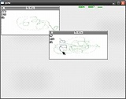](img/helloscreenshot20080824.jpg)

### 2008/08/16
バッチファイルが実行できるようにしました。

winコマンドはバッチファイルにして、mouseコマンドとwindowコマンドを実行するようにしました。

testコマンドはバッチファイルとしてdirコマンドとtypeコマンドを実行します。

これでこの後作るのwindowアプリケーションが実行できるようになりました。

### 2008/08/10
マウスドライバーを書きました。

mouseコマンドをバックグラウンドで起動して、winコマンドを実行すると、デモ画面が表示されます。左クリックで点の色が変わり、右クリックで終了です。

スクリーンショットはこちら。

[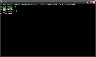](img/helloscreenshot20080810-1.jpg)

[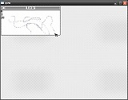](img/helloscreenshot20080810-2.jpg)

### 2008/08/03
マルチウィンドウシステムのエンジン部分だけ書きました。

winコマンドを実行すると、デモ画面が表示されます。何度かキーを押すとデモが進み終了します。

microwindowsを移植しようとしたのですが、ソースコードが長くてあきらめました。スクラッチから書いているので、手抜きばかりです。

ただしVGAドライバーは、パブリックドメインのVGAモードセットアップのソースコードを使わせてもらっています。感謝。

スクリーンショットはこちら。

[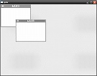](img/helloscreenshot20080803.jpg)

### 2008/01/31
dirコマンドと、typeコマンドだけ作ってあります。プロンプトが出たらコマンドを実行してください。

また、最後にスペースを空けて&マークをつけて実行すると、バックグラウンドで動きます。tstを実行するとバックグラウンド動作が分かりやすいです。

スクリーンショットはこちら。

[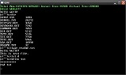](img/helloscreenshot20080131.jpg)
