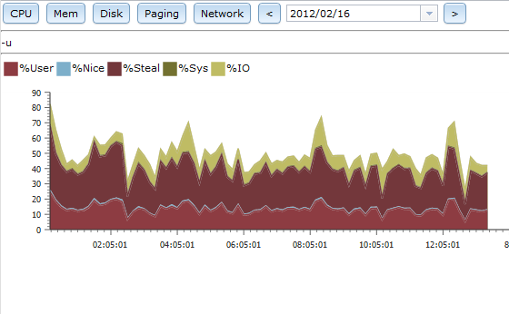

クラウドサーバ環境にシステムモニターが欲しかったのですが、既存のものは大掛かりでなんか大変そうだったので、sysstatの情報をグラフ表示してくれればだけなのにと思い、即興で作ったものです。

Apache経由でブラウザーで見ることが出来ます。

前提のPHPライブラリなど一切ない状態でも動くようになっています。ファイルひとつ置くだけで動くポータブルな造りが特徴です。

PHPでグラフを書く時はGDエクステンションを使うことが一般的ですが、このツールはではまったく使っていません。
グラフ描画はすべて[dojo tookit][dojo]を使っているため、ブラウザ側で行っています。
今までのPHPのグラフ系ツールにはない手法で面白いと思っています。

## 動作環境

- CentOSまたはUbuntuのsysstat
- Apache等のPHP5.2以上が動作するWebサーバー

## ダウンロード

[こちら][sysgraph]からダウンロードしてください。

## インストール

1. sysstatをインストールしてください。

    root# yum install sysstat

2. Apache2.x と　PHP5.xをインストールしてください

    root# yum install httpd php

3. Apatchアカウントにsarコマンドの実行を許可する

    デフォルト状態では許可されているはずです。

4. sysgraph.phpをhtdocs等にコピー

    root# cp sysgraph.php /var/www/html/.

5. apache上のsysgraph.phpにブラウザでアクセスしてください

	http://web/sysgraph.php

6. .htaccessやssl設定をしてアクセスコントロールと暗号化を必要に応じて行ってください。

　　　　バブリッククラウドで使う場合はアクセス制御と暗号化はセキュリティ上必須です。十分に注意して環境に合わせた設定を行ってください。

## 使い方
画面を見ればほぼ分かると思います。

sysstatの値が環境により想定と違う場合がありますので、万が一異常な値ばかりになってしまう場合は適宜調整してください。

[sysgraph]:  https://github.com/koujinogaku/sysgraph
[dojo]:      http://dojotoolkit.org/
