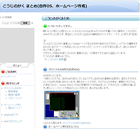

## HTML直書きの限界
昔の僕では考えられないほど綺麗なWebページができたのですが、限界はすぐにやってきました。
そもそも「こうじのがく書庫」は文書を追加・修正する事が頻繁にあります。
作って終わりのホームページとはまったく違うものです。

せっかくレイアウト情報をHTMLから分離してCSSに追い出したのですが、まだまだ文書を編集するにはHTMLは煩雑すぎます。

文章の内容だけを記述し簡単に修正できる方法無いんでしょうか?

## ブログは書庫に使えるか?
ブログではデザインテンプレートを切り替えることで、いろいろな綺麗なデザインになりますね。しかもそのデザインを自分で作ったり誰かの作ったデザインを持ってきて修正したりもできます。

僕も元々ブログは使っていたんですよ。でもデザインテンプレートをいじるのは何か機能を付け加えるのが目的で、デザインをいじろうなんて思ったことはありませんでした。
ブログのHTMLテンプレートもCSSテンプレートも、いかに壊さないようにいじるのかが大事ですね(笑)
しかしCSSが何者であるかが分かったお陰で、デザインをいじれる可能性が出てきました。

でもねブログは文書を保存するライブラリーとしては向きません。箇条書きや画像貼り付けや表や静的ページを何枚も作ってリンクを張って・・・・というのは向いてません。やれば出来るけどそういう事ではないでしょう。 
なぜなら自動生成された箇条書きや画像貼り付けはHTMLとしてブログ本文に保存されるからです。
最近のビジュアルエディター付きブログでも、箇条書きや画像の構造が邪魔になって、文章を気楽に修正できません。
やはりブログは、一度書いたら終了。あとから編集はしないことが前提です。

後から何度も編集するには文書を簡潔に書ける必要があるんです。

## 新たなWikiの視点
そこでWikiに目が留まりました。

そもそもWikiというのは複数の人が協調して文章をアップデートしていく事が目的なので、何度も編集するのは当たり前です。
でもコラボレーションツールという視点でしか見ていなかったので、ブログの様に一人で使うツールを探していた僕には、Wikiは完全に盲点でした。

Wikiではテキスト文章に対して簡素に構造を書くだけで、見る人にだけHTMLを生成してくれます。

たとえばとあるWikiサービスでは

    表題:
　　      *はじめに
    箇条書き:
        - ハンカチ
        - ちり紙
        - 連絡帳
    画像:
       &image(Natto-Teishoku.png)

なんて感じです。

そして書き手が編集するときは元の文書と簡素構造表現だけを見せてくれるのです。
まさに、文書編集には打ってつけです。

そうです、Wikiを一人で使ったっていいんです。

ネット上のWikiサービスを見るとなんとCSSがカスタマイズできるものがあるじゃないですか!
ホムつくで得たCSSの知識を活用し、見事WikiのCSSをゼロから書き起こす事が出来ました。

まあ、そこそこ綺麗でしょ?(笑)

Wikiへの移行によって一気に、文書の更新の頻度が増し、「こうじのがく書庫」の情報量が一気に増えることになりました。

